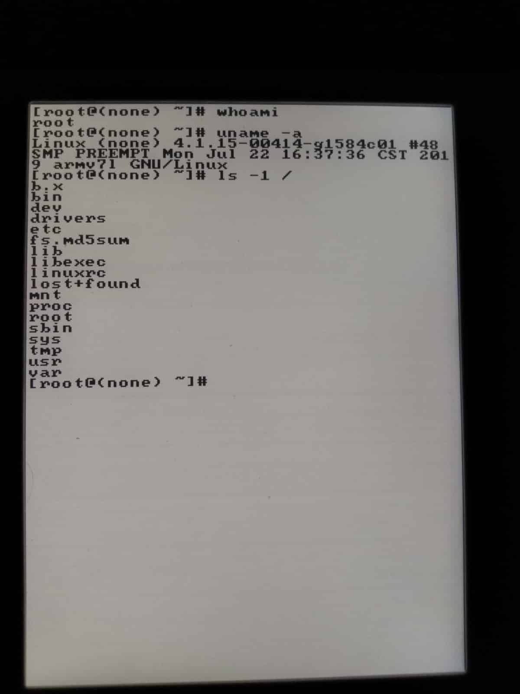

# inkvt

WIP vt100 terminal for the kobo libra h2o (and probably all targets supported by FBInk)

`screen /dev/ttyS0 -s 9600`

Uses FBInk

/lib/modules/5.3.0-28-generic/kernel/drivers/usb/gadget/legacy

https://github.com/pkovac/x86term
